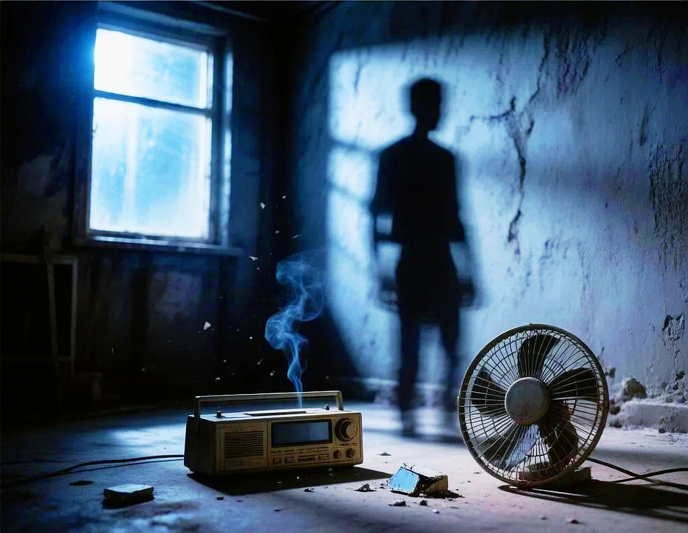
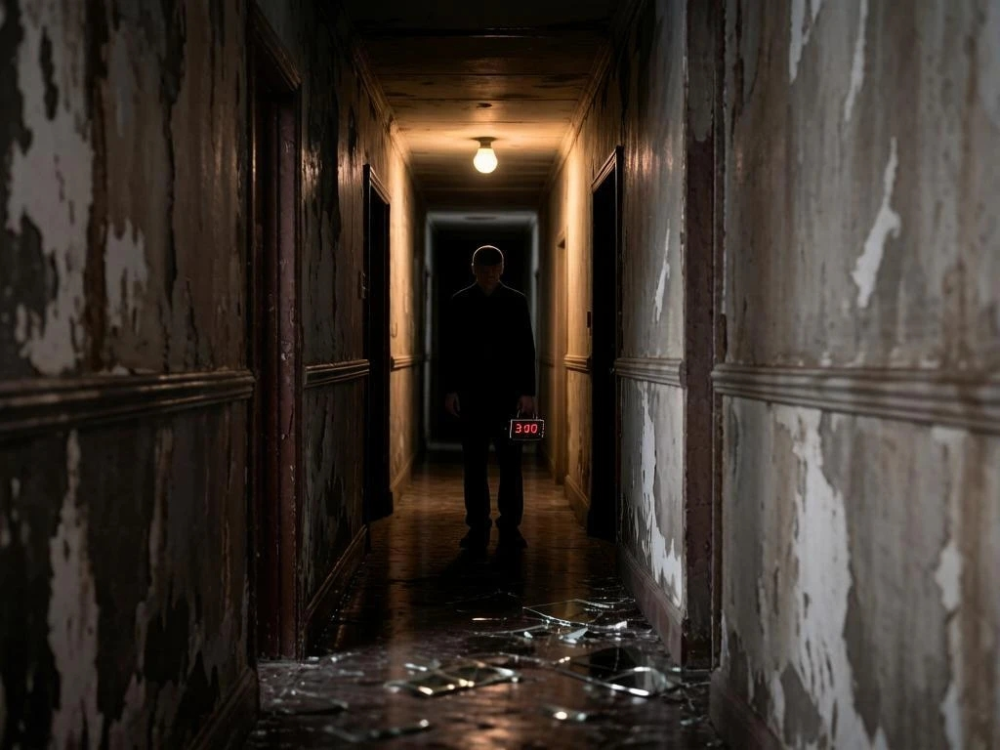
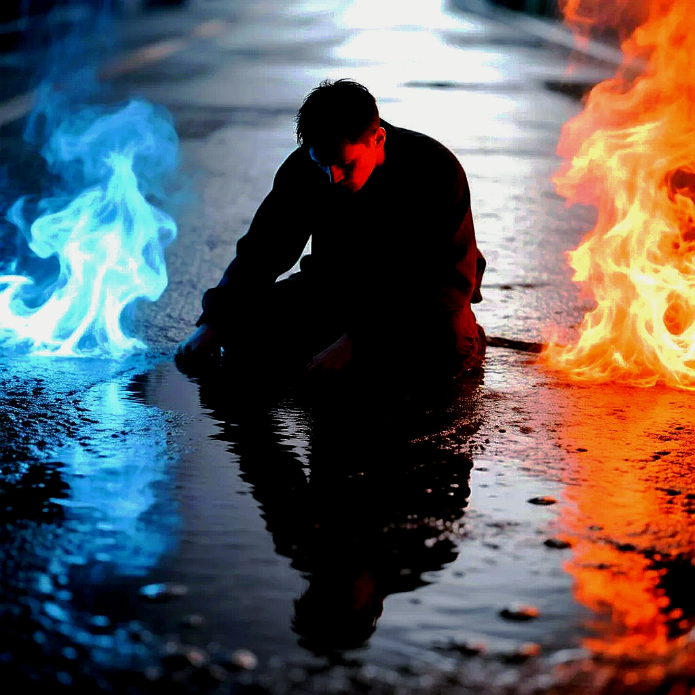
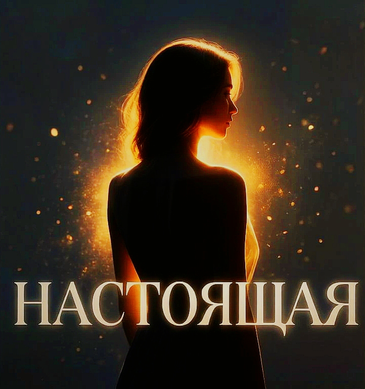

# Альбом «Пепел и свет»

> «Я думал, что пепел — это конец.  
> Но это просто свет, который я не умел читать.  
> Я искал его в чужих глазах —  
> а он всё это время был в моих».

## Трек‑лист

| №   | Название трека           | Смысл и настроение                                                                                                             |
|-----|--------------------------|--------------------------------------------------------------------------------------------------------------------------------|
| 1   | **Два битых прибора**    | Открывающий трек. Отношения, которые ещё теплятся, но уже сломаны. Хрупкость и предчувствие конца.                             |
| 2   | **Снова и снова**        | Бег по кругу. Каждый день — как копия предыдущего, и выхода не видно. Монотонность, затягивающая в рутину.                     |
| 3   | **В моей голове**        | Осознание, что любовь была не к человеку, а к его образу, созданному воображением. Горькое прозрение наедине с собой.          |
| 4   | **Меж двух огней**       | Ситуация выбора между двумя женщинами, которая закончилась потерей обеих. Напряжение, вина и пустота после решения.            |
| 5   | **Настоящая**            | Осознание, что настоящий свет был рядом всё это время. Она не боролась, не кричала — просто ждала, пока он прозреет.           |
| 6   | **Мёртвый свет**         | Финал отношений. Её свет оказался мёртвым, и он навсегда уходит. Тяжёлое принятие, когда надежда окончательно гаснет.          |
| 7   | **Ты**                   | Завершающий трек. Настоящий свет найден — не снаружи, а внутри себя. Спокойствие, которое приходит после всех потерь.          |

---

## Тексты и обложки треков

### Трек 1 — «Два битых прибора»

[Твой текст песни]

---

### Трек 2 — «Снова и снова»

[Твой текст песни]

---

### Трек 3 — «В моей голове»

[Твой текст песни]

---

### Трек 4 — «Меж двух огней»

[Твой текст песни]

---

### Трек 5 — «Настоящая»

[Твой текст песни]

---

### Трек 6 — «Мёртвый свет»

[Твой текст песни]

---

### Трек 7 — «Ты»

[Твой текст песни]
